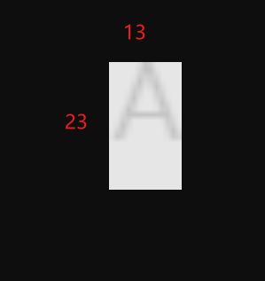
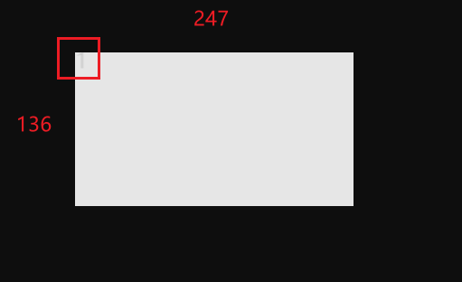
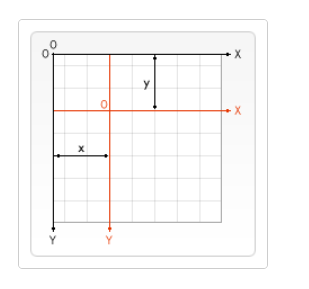

2024/01/30

## 思路

1. 创建 1 个`div`
2. 创建 1 个`canvas`,做一系列操作，然后最终通过`toDataURL`拿到一个 `url`。

   1. mark width99 height45
   2. Text/Image: 根据 23 13 创建一个 canvas：如果是图片直接 drawImage，如果是文体需要 fillText
      这一步得到的 canvas 大小只是内容本身的大小
      
      

   3. Rotate: 根据 23 创建一个 canvas
      1. 通过 translate 将原点移到旋转后画布的中心。
      2. 使用 rotate 对画布进行旋转。
      3. 使用 drawImage 将原始画布
         (canvas) 的内容绘制到旋转后的画布 (rCanvas) 上。
         
   4. 计算旋转后文本边界
      1. 通过遍历四个角的坐标并应用旋转，计算旋转后的文本的左、右、上、下边界。
   5. 最后的呈现咯
        
      

3. 把`url`给`div`做背景图咯。

### 详细解释

1 解释 rCtx.drawImage(canvas, -contentWidth / 2, -contentHeight / 2)

```js
const [ctx, canvas, contentWidth, contentHeight] = prepareCanvas(
  width,
  height,
  ratio
)
const [rCtx, rCanvas, realMaxSize] = prepareCanvas(maxSize, maxSize, ratio)
rCtx.translate(realMaxSize / 2, realMaxSize / 2)
rCtx.rotate(angle)
rCtx.drawImage(canvas, -contentWidth / 2, -contentHeight / 2)
```

drawImage(img,dx,dy),,dx,dy 是指目标图像的左上角在画布上的坐标  
值为负是因为我们希望以目标图像的中心点为基准  

()

## 知识点

### 1 canvas

#### 文字

ctx.fillText(text, x, y, maxWidth)

#### transform

ctx.translate(x, y)


#### ctx.drawImage(image,dx,dy)

image 可以是 canvas
